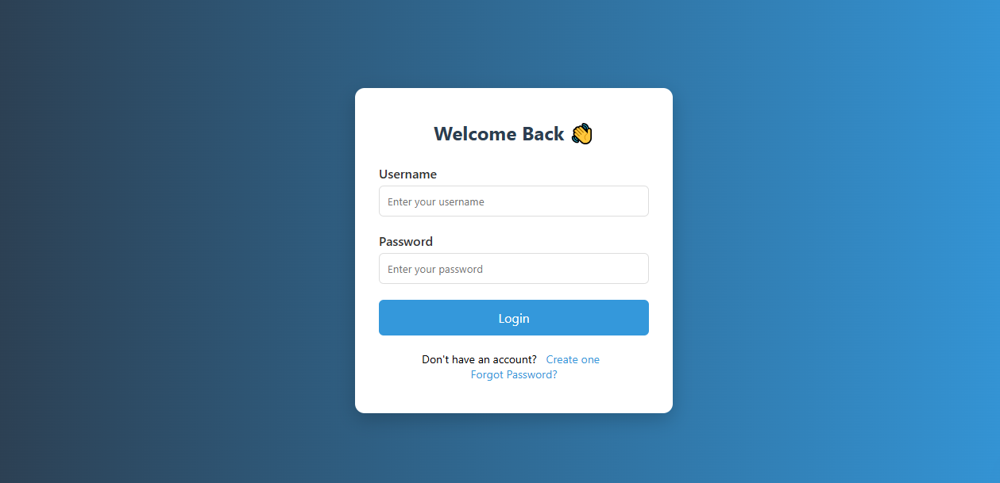
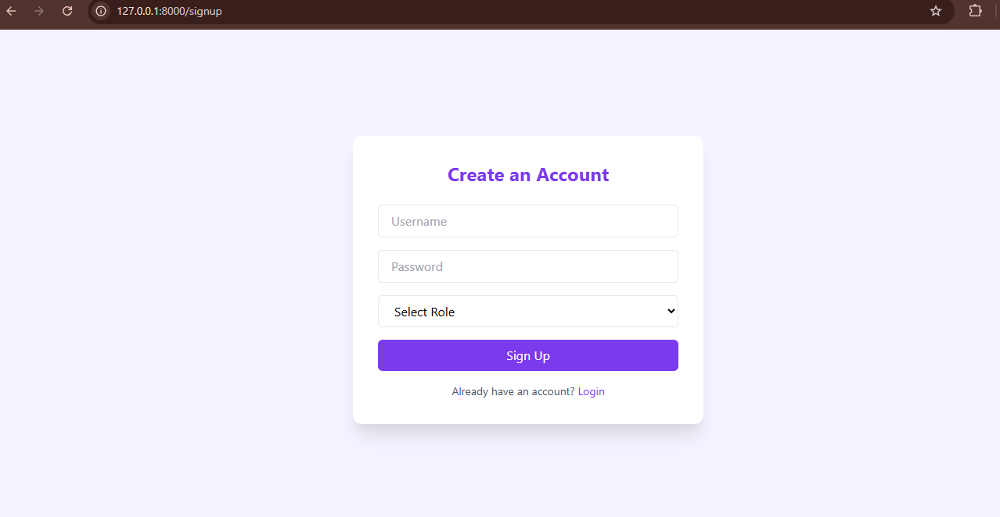
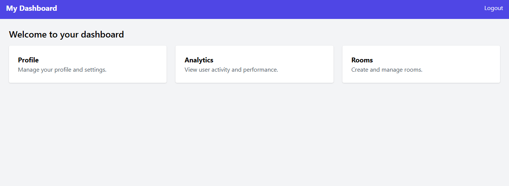

# 🚀 FastAPI Role-Based Chat Application with Admin & Analytics

This is a **FastAPI-based web application** featuring user authentication (signup/login), JWT-based session handling, WebSocket chat rooms, admin panel integration, and real-time analytics. Built using FastAPI, SQLAlchemy, Jinja2, and WebSockets.

---

## 📸 Preview

### 🔐 Login Page


### 🏠 signup Page


### 📊 Dashboard Page



---

## 🧩 Features

- 🧑‍💻 User Signup/Login with Role (admin/user)
- 🔐 Secure JWT-based authentication
- 📡 Real-time chat via WebSockets
- 📈 Analytics dashboard with FastAPI routing
- 🛠 Admin panel integration
- 📁 Jinja2 Templates + Static CSS/JS

---

## ⚙️ Tech Stack

- [FastAPI](https://fastapi.tiangolo.com/)
- [SQLAlchemy](https://www.sqlalchemy.org/)
- [Jinja2](https://jinja.palletsprojects.com/)
- [WebSockets](https://developer.mozilla.org/en-US/docs/Web/API/WebSockets_API)
- postgresql
- HTML5 + CSS3 + JS (Static)

---

## 🚀 Setup & Installation

### 1. Clone the repository

```bash
git clone https://github.com/abhishekk1004/chatapp.git
cd internship


2. Create and activate a virtual environment
    bash
        python -m venv venv
        source venv/bin/activate  # Linux/macOS
        venv\Scripts\activate     # Windows


3. Install dependencies
        pip install -r requirements.txt


4. Run the app
        uvicorn main:app --reload


📂 Directory Structure

    ├── main.py
    ├── models.py
    ├── database.py
    ├── schemas.py
    ├── auth.py
    ├── admin.py
    ├── analytics.py
    ├── templates/
    │      ├── index.html
    │      ├── login.html
    │      └── dashboard.html
    ├── static/
    │   ├── css/
    │   │   └── style.css
    │   └── images/
    │       └── dashboard-example.png
    └── README.md


🔐 Routes Summary
    Method	Endpoint	Description
    POST	/signup	User registration
    POST	/login	User login & token gen
    GET	/	Home/Index page
    GET	/login	Login HTML page
    GET	/dashboard	Protected dashboard
    POST	/rooms	Create chat room
    WebSocket	/ws/{room}	Join chat room

📌 Admin Panel
    FastAPI admin is integrated via setup_admin(app) function. Accessible only for users with admin roles.

💬 License
    This project is licensed under the MIT License. Free to use and modify.

🧑‍💻 Author
Made with ❤️ by Abhishek 

    Let me know if you'd like me to generate actual image assets, CSS files, or change the tone (e.g., more casual or professional).
